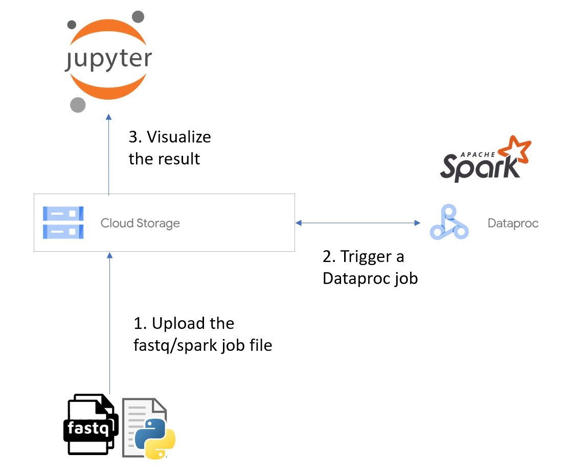

### Overview

FastQC is a quality control tool for high throughput sequence data that based on Java. SparkFastQC rewrites the FastQC in the Apache Spark framework which supports distributed computing. The application supports the following analysis:
1.	Basic Statistic (Total Sequence, Total Number of Bases, Range of Sequence Length)
2.	Sequence Length Distribution
3.	Per Sequence Quality Scores
4.	Per base sequence quality
5.	Per Base Sequence Content
6.	Per Base N Content
7.	Overrepresented sequences

### Framework

### Prerequisites
1.	Google Cloud Project
a.	An empty Cloud Storage bucket
b.	A Dataproc Cluster
c.	A JSON service account credentials file, the service account should have the below privileges:
    * dataproc.clusters.use
    * dataproc.jobs.create
    * dataproc.jobs.get
    * storage.objects.create
    * storage.objects.delete
    * storage.objects.get
    * storage.objects.list
2.	Python
3.	Jupyter Notebook

### Instructions

#### Dataproc job submission
1.	Prepare a .fastq file, samples can be obtained from https://diytranscriptomics.com/data
2.	Fill in the configurations in /dataproc/main.py
    * project_id
    * bucket_name
    * region
    * cluster_name
    * service_account_json
    * fastq_fn
    * sparkjob_fn
    * result_fn
3.  Configure the settings in /dataproc/sparkjob.py (Optional)
4.	Install the required package in /dataproc/requirement.txt
5.	Execute /dataproc/main.py
6.	The result should be downloaded in a .json format

#### Visualization
1.	Fill in the file path in /analysis/SparkFastQC.ipynb
2.	Execute /analysis/SparkFastQC.ipynb